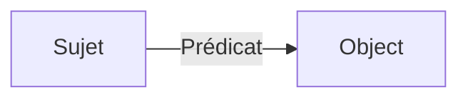
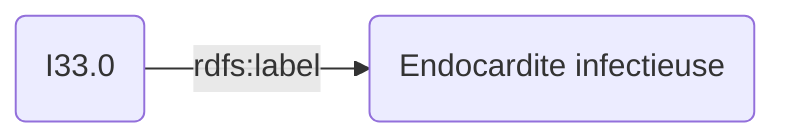

Dans ce billet, nous allons voir comment extraire des codes [CIM-10](https://fr.wikipedia.org/wiki/Classification_internationale_des_maladies#CIM-10) à partir d’un fichier RDF télécharger depuis le [serveur multi-terminologique](https://smt.esante.gouv.fr/), en utilisant le langage [SPARQL](https://en.wikipedia.org/wiki/SPARQL) dans un script Python.


## C'est quoi un fichier RDF ? 

Un [fichier RDF](https://fr.wikipedia.org/wiki/Resource_Description_Framework) (Resource Description Framework) est un modèle de données conçu pour représenter et relier des concepts issus d’une terminologie de manière hiérarchique et standardisée.
Par exemple, la terminologie CIM-10 attribue à chaque maladie un code unique, utilisé notamment pour la codification des actes médicaux dans le cadre du [PMSI](https://fr.wikipedia.org/wiki/Programme_de_m%C3%A9dicalisation_des_syst%C3%A8mes_d%27information) (Programme de médicalisation des systèmes d'information).

De manière simplifiée, un fichier RDF est constitué d’une liste de triplets (sujet, prédicat, objet), qui peuvent être illustrés de la façon suivante :



Le triplet suivant, par exemple, associe le code I33.0 à son libellé : "Endocardite infectieuse".



Il existe différentes terminologies dans le domaine médical, que vous pouvez télécharger au format RDF depuis le [serveur multi-terminologique](https://smt.esante.gouv.fr/bienvenue/) de l’Agence de la santé.
Une fois le fichier RDF téléchargé, vous pouvez l’explorer à l’aide d’un logiciel comme [Protégé](https://protege.stanford.edu/), ou de manière programmatique en Python à l’aide de la bibliothèque [rdflib](https://rdflib.readthedocs.io/en/stable/#).

## Requêter en SPARQL 

Pour explorer une terminologie, vous pouvez utiliser le langage [SPARQL](https://fr.wikipedia.org/wiki/SPARQL). Le principe est simple : il suffit d’écrire des triplets en remplaçant l’élément recherché par une **?variable**.    
Par exemple, la requête suivante permet de retrouver le libellé associé au code CIM-10 *I33.0* :

```sparql
	PREFIX rdfs: <http://www.w3.org/2000/01/rdf-schema#>
    PREFIX skos: <http://www.w3.org/2004/02/skos/core#>

    SELECT ?concept ?label
    WHERE {
    ?concept skos:notation 'I33.0'.
    ?concept rdfs:label ?label.
}


```

Vous pouvez tester directement cette requête en ligne sur le serveur terminologique à l'adresse suivante: https://smt.esante.gouv.fr/sparql/


## Générer un dataframe 
Si, comme moi, vous préférez manipuler un DataFrame en Python, je vous propose ce code qui permet d’extraire depuis [le fichier RDF de la CIM-10](https://smt.esante.gouv.fr/terminologie-cim-10/): le code, le libellé, le chemin hiérarchique, les synonymes et les notes.

```python
import rdflib
import polars 

# Chargement de la terminologie
g = rdflib.Graph()
g.parse("cim10.rdf")

# Requete SPARQL pour récupérer les variables d'interets
query = """
PREFIX rdfs: <http://www.w3.org/2000/01/rdf-schema#>
PREFIX skos: <http://www.w3.org/2004/02/skos/core#>
PREFIX skos: <http://www.w3.org/2004/02/skos/core#>
PREFIX xkos: <http://rdf-vocabulary.ddialliance.org/xkos#>
PREFIX dc: <http://purl.org/dc/elements/1.1/>
PREFIX atih: <http://data.esante.gouv.fr/atih/>
SELECT ?concept ?code ?label ?path ?type ?synonymes ?inclusion_note ?exclusion_note
WHERE {
?concept rdfs:subClassOf* atih:cim10 .
?concept rdfs:label ?label.
?concept skos:notation ?code.
?concept rdfs:subClassOf+ ?superClass.
?superClass skos:notation ?path.
?concept dc:type ?type.
OPTIONAL { ?concept skos:altLabel ?synonymes. }
OPTIONAL { ?concept atih:inclusionNote ?inclusion_note . }
OPTIONAL { ?concept atih:exclusionNote ?exclusion_note . }
}
"""

# Execution de la requete SPARQL
records = g.query(sparql)

# Génération d'un dataframe pola.rs
columns = [str(i) for i in records.vars]

recs = []
for rec in records:
    if isinstance(rec, tuple):
        recs.append(rec)
    else:
        raise TypeError("Records must contains iterable ")

df = pl.DataFrame([{str.upper(columns[i]): str(v) for i, v in enumerate(rec)} for rec in recs])

df = df.group_by("CONCEPT").agg(
        pl.col("CODE").first(),
        pl.col("CODE").first().str.replace("\.", "").alias("CODE_2"),
        pl.col("LABEL").first(),
        pl.col("PATH").reverse(),
        pl.col("SYNONYMES").drop_nulls(),
        pl.col("TYPE").first(),
        pl.col("INCLUSION_NOTE").first(),
        pl.col("EXCLUSION_NOTE").first(),
    )


df.write_parquet("cim10.parquet")

```


## En conclusion 
Ces fichiers RDF sont particulièrement utiles et ont de nombreuses applications, en particulier grâce à la structuration hiérarchique des concepts.    
Pour ceux que ça interesse, j’ai mis à disposition plusieurs requêtes SPARQL pour d’autres ontologies :

- [Extraction CCAM](https://gist.github.com/dridk/3be7d1994b7e11b95579d70c3a223c61)
- [Extraction ATC](https://gist.github.com/dridk/a19c9ce19afb929c5715b977986460d7)
- [Extraction ADICAP](https://gist.github.com/dridk/2cb015792bcf7db82cc7f9eb6f00f2fc)


